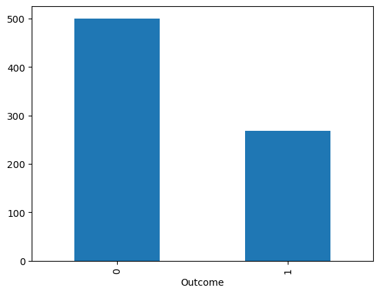
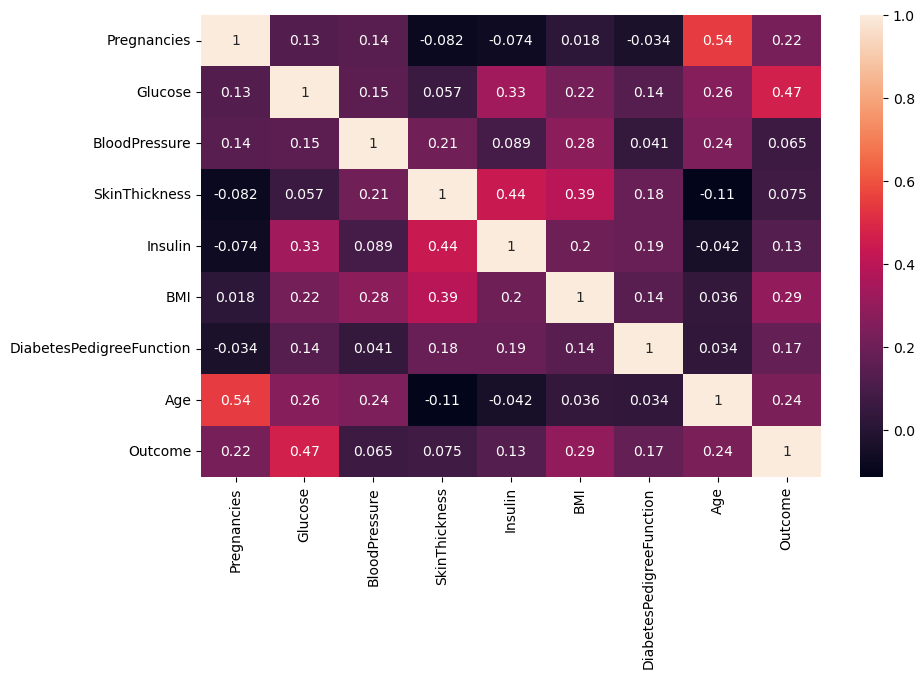

# Diabetes Prediction using Machine Learning


## Project overview
The goal of this project is to use machine learning technologies to identify individuals at high risk of developing diabetes. For the prediction, I used three different algorithms: logistic regression, decision tree, and random forest, and then compared the results to determine which of the three was most accurate.

## Project Structure
``` text
diabetes-risk-ml-project/
│
├── data/
│   └── diabetes.csv
│
├── notebooks/
│   └── diabetes_analysis.ipynb
│
├── models/
│   └── diabetes_model.pkl
│
├── src/
│   └── prediction_diabetes.py
│
├── images/
│   └── plots used in the README
│
├──README.md
|
└──requirements.txt
```

## Dataset
I downloaded the dataset from Kaggle, but it originally came from the National Institute of Diabetes and Digestive and Kidney Diseases. The dataset's objective is to predict whether a patient has diabetes, based on certain diagnostic measurements included in the dataset. Several restrictions were imposed on the selection of these cases from a larger database. In particular, all included patients are women at least 21 years old and of Pima Indian descent.
The dataset consists of several medical predictor variables and one target variable: the outcome. The predictor variables include the patient's number of pregnancies, her BMI, insulin level, age, and so on.


## Exploratory data analysis

First i analysed the dataset to understand the relations of variables and to search possibly patterns.


in this graphic we can see how a higher BMI glucose increases considerably.



Here is the outcome of dataset and show how many individual have or not diabetes.


The histogram shows the range of glucose values ​​and their distribution within the dataset. For example, this graph shows that 60 people have a glucose level close to 100.


This is the histogram after the clean of dataset using the median to delete wrong values like age = 0 or glucose = 0.



This graph shows how closely the variables are related to each other.


This graph compares the age of people with and without diabetes. As we can see, the majority of people with diabetes are older.

## Data Preprocessing
Before training the models, several preprocessing steps were performed to improve data quality and model performance.

First, the dataset was inspected for invalid or missing values. Some variables, such as glucose, blood pressure, skin thickness, insulin, and BMI, contained zero values, which are not medically possible and likely represent missing data.

To handle these values, they were replaced with the median of the corresponding variable to reduce the impact of outliers.

After cleaning the dataset, it was split into training and test sets using an 80/20 split.

Next, field scaling was applied using StandardScaler to normalize the input variables. Scaling is important for algorithms like logistic regression because it ensures that all features contribute equally to the model.

## Machine Learning Models
Three different machine learning algorithms were trained and compared in this project:

Logistic Regression

Logistic Regression used for binary classification problems. In this project, it was used as a baseline model to predict whether a patient has diabetes.

Decision Tree

Decision Trees classify data by splitting it into branches based on feature values. Each internal node represents a decision rule, and each leaf node represents a prediction. Decision Trees are easy to interpret and can capture nonlinear relationships between variables.

Random Forest

Random Forest is an ensemble learning method that combines multiple decision trees to improve predictive performance and reduce overfitting. Each tree is trained on a random subset of the data, and the final prediction is obtained by aggregating the predictions of all trees.
This model usually performs well in structured datasets such as medical data.

## Model Evaluation
To evaluate the performance of the models, the dataset was split into training and testing sets. The models were trained using the training data and evaluated on the testing data.

Several metrics were used to assess model performance:

Accuracy – measures the proportion of correct predictions.
Logistic: 0.7662337662337663
Decision Tree: 0.7077922077922078
Random Forest: 0.7662337662337663

Precision – measures how many predicted positive cases were actually positive.

Recall – measures how many actual positive cases were correctly identified.

F1-score – the harmonic mean of precision and recall.

In addition, a confusion matrix was used to visualize the number of true positives, true negatives, false positives, and false negatives produced by the models.


precision    recall  f1-score   support

           0       0.82      0.82      0.82        99
           1       0.67      0.67      0.67        55

    accuracy                           0.77       154
   macro avg       0.75      0.75      0.75       154
weighted avg       0.77      0.77      0.77       154

## Results
After training and evaluating the models, the performance of the algorithms was compared.

Among the tested models, Random Forest achieved the best overall performance, showing higher accuracy and better generalization on the test dataset compared to Logistic Regression and Decision Tree.

Feature importance analysis also showed that variables such as Glucose, BMI, and Age play an important role in predicting diabetes risk.

These results suggest that ensemble methods like Random Forest can be particularly effective for medical classification problems using structured clinical data.

## Future Improvements
Although the current model provides reasonable performance, several improvements could be explored in future work like:

Perform hyperparameter tuning to optimize model performance.

Test additional machine learning algorithms such as Support Vector Machines or Gradient Boosting.

Use cross-validation to obtain more robust performance estimates.

Incorporate additional medical variables or larger datasets.

Develop a small application or API that allows users to input patient data and obtain predictions from the trained model.
